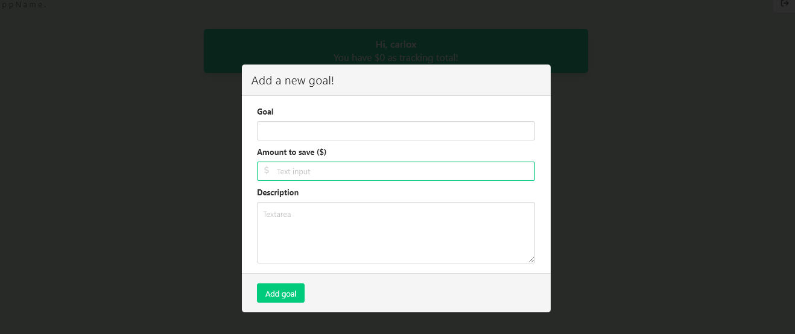
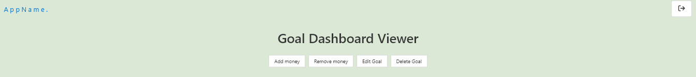
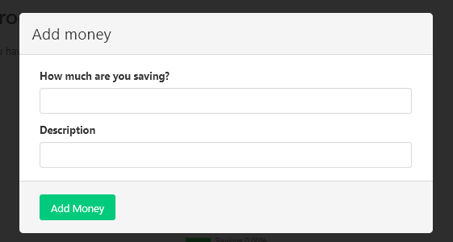
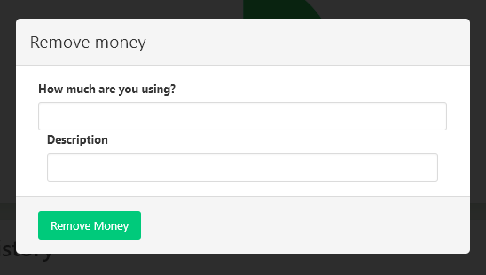
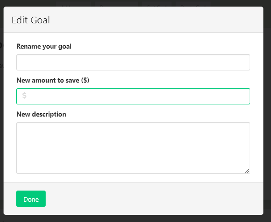
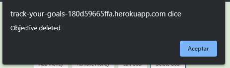
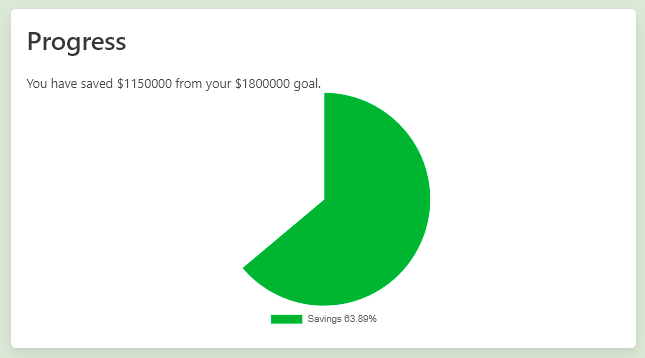
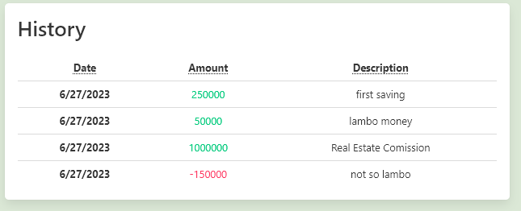
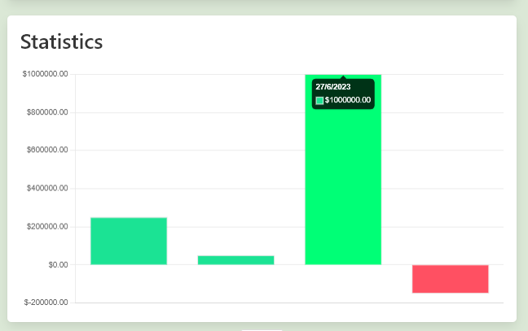

# **TrackYourGoals**

# TYG 
## Is a real world solution for everyone who wants to keep track and fulfill personal economic development. 

## **Drive Towards Your Financial Goals.** 

### <p> The world is financially real. Our financial health is a key detonator for life wellness. We think planning and discipline can help us move forward towards our goals and that technology can help us make it happen.
### <p>**TYG** aids us with keeping track of our savings. Its bold and secure interface intuitively helps us create user profiles and as many financial goals as needed, and most important keep track, wherever you are. 
## Build Status
## Table of Contents : 
1. [Project Description](#tyg) 
2. [Installation](#installation)
3. [Usage](#usage)
4. [Build](#build)
5. [Api Reference](#api)
6. [Team Challenges](#challenges)
7. [Features](#features)
8. [Code Examples](#code)
9. [Credits](#credits)
10. [Licence](#licence)
## Installation:
Github  
```md 
https://github.com/1alyciaoliveira/TrackYourGoals.git
```

Heroku  
``` md 
https://track-your-goals-180d59665ffa.herokuapp.com/login
```  
Local  
``` md 
git clone https://github.com/1alyciaoliveira/TrackYourGoals.git
```

## Usage: (sreenshots)
#### Signing Up

- Add up email, username.
- Create password at least 8 characters long maximum 128.
- Recieve almost instantly email confirmation and a secure key. 
- Authorize profile creation by adding confirmation key on prompt.
- Go back to log interface after acount creation.

#### Log In

Prompted to add your User Name and Secret Password. 

#### ADD a New Goal
  

Navigate towards creation of your new financial objective.    

- Add a goal title.  
- Add a saving amount. 
- Add a thorough goal description. 

### Goal Dashboard Viewer

- Goal Transaction Menu  

    Add Money  
  
    Remove Money  
    - Withdrawal button, keep track of those financial moments where we have to change strategy and spend some of our savings for a good reason. Keep track of those expenditures. 
    
    Goal Editing  
    - Clic on goal title to modify.  
  
    Delete Goal
  
- Track Your Progress

- Track Your Transaction History 

- View Your Transaction Statistics 


## Future Development
 - Let make real bank transactions through app.
 - Erase Account. 
 - Goal Fulfillment Congratulation Animation. 
 - Link to goal wish page. 

## Build:
- Undraw.co (SVG)
- NPM modules
  - Nodemailer 
  - Sequelize
 - Bulma (CSS Styles)
 - Handlebars (Template Engine)
 - MySQL (Database)
 - Javascript 
 - HTML
## MVC
## **Models**
index.js  
```js
const User = require('./User');
const Transaction = require('./Transaction');
const Objective = require('./Objective');
const Verification = require('./Verification');
const Recovery = require('./Recovery');


User.hasMany(Objective, {
    foreignKey: 'user_id',
    onDelete: 'CASCADE'
});

Objective.belongsTo(User, {
    foreignKey: 'user_id'
});

User.hasMany(Transaction, {
    foreignKey: 'user_id',
    onDelete: 'CASCADE'
});

Objective.hasMany(Transaction, {
    foreignKey: 'objective_id',
    onDelete: 'CASCADE'
});

Transaction.belongsTo(Objective, {
    foreignKey:'objective_id'
});

module.exports = { User, Transaction, Objective, Verification , Recovery};
```
- Objective.js
``` js 
const { Model, DataTypes } = require('sequelize');
const sequelize = require('../config/connection');

class Objective extends Model { }

Objective.init(
    {
        id: {
            type: DataTypes.INTEGER,
            allowNull: false,
            primaryKey: true,
            autoIncrement: true,
        },
        user_id: {
            type: DataTypes.INTEGER,
            references: {
                model: 'user',
                key: 'id',
            },
        },
        name: {
            type: DataTypes.STRING,
            allowNull: false,
        },
        target_quantity: {
            type: DataTypes.INTEGER,
            allowNull:false
        },
        image_path: {
            type: DataTypes.STRING,
            allowNull:true
        },
        description: {
            type: DataTypes.STRING,
        },
        date_created: {
            type: DataTypes.DATE,
            allowNull: false,
            defaultValue: DataTypes.NOW,
        }        
    },
    {
        sequelize,
        timestamps: false,
        freezeTableName: true,
        underscored: true,
        modelName: 'objective',
    }
);

module.exports = Objective;

```
- Recovery.js 
Github  
```js
const { Model, DataTypes } = require('sequelize');
const sequelize = require('../config/connection');

class Recovery extends Model {}

Recovery.init(
    {
        id: {
            type: DataTypes.INTEGER,
            allowNull: false,
            primaryKey: true,
            autoIncrement: true,
        },
        email: {
            type: DataTypes.STRING,
            allowNull: false,
            unique: true,
            validate: {
                isEmail: true,
            },
        },
        code: {
            type: DataTypes.INTEGER,
            allowNull: false,
        }
    },
    {       
        sequelize,
        timestamps: false,
        freezeTableName: true,
        underscored: true,
        modelName: 'recovery',
    }
);

module.exports = Recovery;

```

- Transaction.js
- User.js 
- Verification.js
## **View**
### Layouts
- main.handlebars  
- Partials  
    - objectivesitems.handlebars  
    - transactionhistory.handlebars
- confirmmail.handlebars
- goal.handlebars
- login.handlebars
- password.handlebars
- profile.handlebars
- sendrecoverycode.handlebars
- signup.handlebars

## **Controller**
- homeRoutes.js
- Index.js
### API
- index.js
- objectiveRoutes.js 
- recoveryRoutes.js 
- transactionRoutes.js 
- userRoutes.js 
- verificationRoutes.js

## Challenges 
- We faced the huge challenge to make a full stack application deployment from scratch in just about week and half. 
- We faced the challenge of not being all at the same knowlege and experience level. 


## Features 
 - what makes our project stand out

## Credits 
Alycia Olyveria  
Jessica Sanchez  
Santiago Valenzuela  
Rodrigo Roldan   
Carlos Campos   
