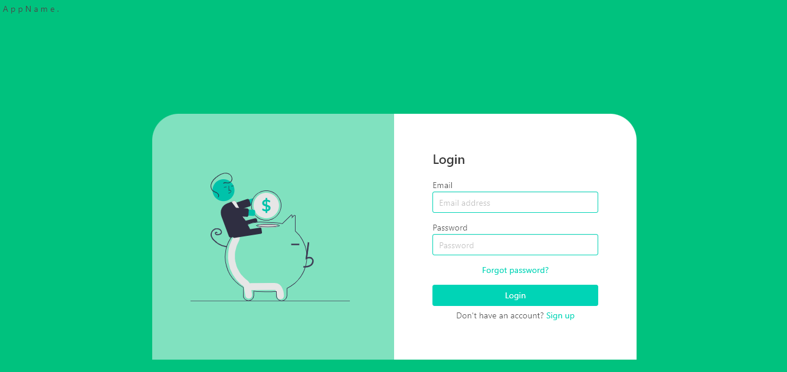
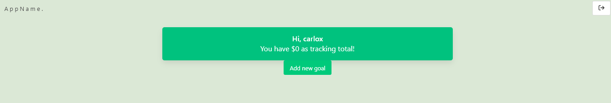

# **TrackYourGoals**

# TYG 
## Is a real world solution for everyone who wants to keep track and fulfill personal economic development. 

## **Drive Towards Your Financial Goals.** 

### <p> The world is financially real. Our financial health is a key detonator for life wellness. We think planning and discipline can help us move forward towards our goals and that technology can help us make it happen.
### <p>**TYG** aids us with keeping track of our savings. Its bold and secure interface intuitively helps us create user profiles and as many financial goals as needed, and most important keep track, wherever you are. 
## Build Status
## Table of Contents : 
1. [Project Description](#tyg) 
2. [Installation](#installation)
3. [Usage](#usage)
4. [Build](#build)
5. [Api Reference](#api)
6. [Team Challenges](#challenges)
7. [Features](#features)
8. [Code Examples](#code)
9. [Credits](#credits)
10. [Licence](#licence)
## Installation:
Github  
```md 
https://github.com/1alyciaoliveira/TrackYourGoals.git
```

Heroku  
``` md 
https://track-your-goals-180d59665ffa.herokuapp.com/login
```  
Local  
``` md 
git clone https://github.com/1alyciaoliveira/TrackYourGoals.git
```

## Usage: (sreenshots)
#### Signing Up

- Add up email, username.
- Create password at least 8 characters long maximum 128.
- Recieve almost instantly email confirmation and a secure key. 
- Authorize profile creation by adding confirmation key on prompt.
- Go back to log interface after acount creation.

#### Log In

- Prompted to add your User Name and Secret Password. 

#### ADD a New Goal
  

- Navigate towards creation of your new financial objective.    

- Add a goal title.  
- Add a saving amount. 
- Add a thorough goal description. 

### Goal Dashboard Viewer

- Goal Transaction Menu  
  - Add Money 
  - Remove Money
  - Edit Goal
  - Delete Goal
- Progress
- History 
- Statistics 

### Edit Goal
- Clic on goal title to modify.
- Register the time preference and frequency of saving.
- Withdrawal button, keep track of those financial moments where we have to change strategy and spend some of our savings for a good reason. Keep track of those expenditures.   

## Build:
- Undraw.co (SVG)
- NPM modules
  - Nodemailer 
 - Bulma 
 - Sequelize 
 - MySQL

## API:
- api 1

## Challenges 
- challenges you faced and features you hope to implement in the future. 

## Features 
 - what makes our project stand out

## Code
- example 01

## Contribute (contributing guideline)
## Credits 
Alycia Olyveria  
Jessica Sanchez  
Santiago Valenzuela  
Rodrigo Roldan   
Carlos Campos   
## Licence 